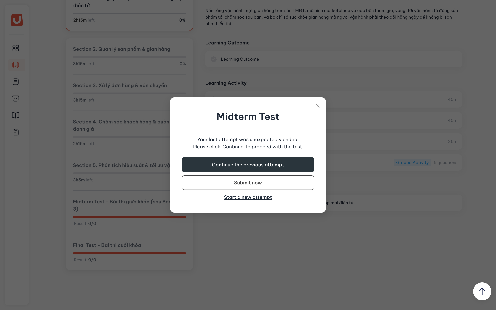

# Danh sách khóa học

## I. Thông tin chung


**Dành cho:** Học viên (Student)

**Đường dẫn:** [LMS → My Course](https://lms-upbase.edu.asia/courses)



#### Phạm vi & Module liên quan

* **Module chính:** LMS Student — My Course
* **Module liên quan:** Course Detail, Class Management, Program Management
* **Phạm vi áp dụng:** Tất cả các khóa học mà học viên đã đăng ký, bao gồm khóa chính, khóa thử và khóa ôn.



#### Điều kiện tiên quyết

* Học viên đã **đăng ký khóa học** (bao gồm khóa học chính thức hoặc khóa học thử).
* Học viên đã **đăng nhập** hệ thống LMS thành công với tài khoản được cung cấp.


## II. Hướng dẫn chi tiết

Xem danh sách Khóa học



**Truy cập màn hình My Course**

Sau khi đăng nhập hệ thống thành công, học viên chọn màn hình **My Course** để xem tất cả những khóa học mà học viên đã đăng ký.

<figure><figcaption></figcaption></figure>

Tại màn hình này, học viên sẽ thấy thông tin cụ thể của từng Khóa học:

* **Tên Khóa học**
* **Mã Lớp**
* **Thời hạn còn lại của Khóa học**
* **Giới thiệu tổng quan về Khóa học**
* **Tiến độ học của học viên**



Tìm kiếm Khóa học theo tên



**Nhập tên Khóa học vào thanh tìm kiếm**

<figure><figcaption></figcaption></figure>



**Nhấn Enter để tìm kiếm khóa học**

Sau khi nhập, đợi **3–5 giây** hoặc nhấn **Enter**, hệ thống sẽ trả ra các kết quả phù hợp với điều kiện tìm kiếm cùng với tổng số kết quả.

_Kết quả tìm kiếm Khóa học theo tên_

<figure><figcaption></figcaption></figure>



Lọc Khóa học theo điều kiện cho trước



**Mở bộ lọc**

Tại màn hình **My Course**, học viên nhấp vào nút **Filter** theo **Chương trình học** hoặc theo **Trạng thái của Khóa học**.

_Bộ lọc theo Chương trình học_

<figure><figcaption></figcaption></figure>

_Bộ lọc theo Trạng thái của Khóa học_

<figure><figcaption></figcaption></figure>



**Chọn điều kiện lọc**

Chọn **Chương trình** hoặc **Trạng thái** muốn xem để lọc các Khóa học thỏa mãn. Người dùng có thể **lọc kết hợp** các điều kiện cùng lúc.

_Kết quả sau khi lọc theo điều kiện_

<figure><figcaption></figcaption></figure>


💡 **Mẹo:** Học viên có thể sử dụng **kết hợp** chức năng _Tìm kiếm Khóa học theo tên_ và _Lọc Khóa học theo điều kiện cho trước_ để thu hẹp kết quả nhanh hơn.




## III. Lưu Ý & Quy Tắc Nghiệp Vụ


### Lưu ý quan trọng

1. Màn hình **My Course** chỉ hiển thị các khóa học mà học viên **đã được đăng ký** trên hệ thống. Nếu không thấy khóa học mong muốn, học viên cần kiểm tra lại tình trạng đăng ký với phòng tư vấn của UpBase.
2. Thông tin **Thời hạn còn lại của Khóa học** sẽ hiển thị khác nhau theo loại khóa học:
   * **Khóa học có thời hạn cố định:** thời hạn được tính theo lịch trình chung của lớp.
   * **Khóa học có thời hạn linh động:** thời hạn được tính từ thời điểm học viên **kích hoạt (Activate)** khóa học.
   * **Khóa học thử:** có thể được **Extend** một lần khi hết hạn lần đầu tiên; sau lần thứ 2 cần liên hệ với đội ngũ hỗ trợ tại UpBase.
3. Bộ lọc hỗ trợ **lọc kết hợp** nhiều điều kiện cùng lúc (vừa Chương trình vừa Trạng thái) và có thể kết hợp với tìm kiếm theo tên.
4. **Tiến độ học** hiển thị trên card được tính dựa trên số Activity đã hoàn thành trên tổng số Activity của khóa học.



### Mẹo sử dụng

1. Khi có nhiều khóa học, sử dụng **bộ lọc theo Chương trình** để nhanh chóng nhìn thấy các khóa cùng chương trình.
2. Sử dụng **bộ lọc theo Trạng thái** để xác định các khóa đang học, sắp hết hạn hoặc cần kích hoạt.
3. Kết hợp **tìm kiếm theo tên + bộ lọc** khi danh sách khóa học dài để thu hẹp kết quả nhanh hơn.
4. Theo dõi **Thời hạn còn lại** trên card để chủ động hoàn thành khóa học trước khi hết hạn.
5. Đối chiếu **Tiến độ học** giữa các khóa học để cân đối thời gian học giữa các môn.


## IV. Các Lỗi Thường Gặp & Cách Xử Lý

| Lỗi / Tình huống                                                 | Nguyên nhân                                                                     | Cách xử lý                                                                                                            |
| ---------------------------------------------------------------- | ------------------------------------------------------------------------------- | --------------------------------------------------------------------------------------------------------------------- |
| Không thấy bất kỳ khóa học nào trong My Course                   | Tài khoản chưa được gán vào lớp / chưa hoàn tất đăng ký khóa học                | Liên hệ phòng tư vấn của UpBase để kiểm tra tình trạng đăng ký và gán lớp.                                              |
| Tìm kiếm theo tên không trả về kết quả mong đợi                  | Nhập sai chính tả hoặc tên khóa học khác với tên hiển thị trên hệ thống         | Kiểm tra lại chính tả; thử nhập từ khóa ngắn hơn (chỉ một phần tên); kết hợp dùng bộ lọc theo Chương trình.           |
| Đã lọc nhưng vẫn không thấy khóa học cần tìm                     | Điều kiện lọc quá hẹp hoặc khóa học không thuộc Chương trình/Trạng thái đã chọn | Bỏ bớt điều kiện lọc, hoặc reset bộ lọc rồi thử lại với các điều kiện khác.                                           |
| Thông tin **Thời hạn còn lại** hiển thị "0 ngày" hoặc đã hết hạn | Khóa học đã hết thời hạn truy cập                                               | Với khóa học thử: click **Extend** để gia hạn lần đầu. Với khóa học khác: liên hệ đội ngũ hỗ trợ UpBase để được hỗ trợ. |
| Khóa học thử không có nút Extend khi hết hạn                     | Khóa học thử đã được Extend trước đó (chỉ được gia hạn tự động 1 lần)           | Liên hệ với đội ngũ hỗ trợ UpBase để được hỗ trợ tiếp tục gia hạn.                                                      |
| Tiến độ học không cập nhật dù đã hoàn thành Activity             | Activity chưa được đánh dấu Completed hoặc cần tải lại trang                    | Hoàn thành lại Activity và đảm bảo có nút Completed hiển thị; tải lại trang My Course để cập nhật.                    |
| Bộ lọc bị "kẹt" hiển thị danh sách trống                         | Lọc kết hợp nhiều điều kiện không có khóa học nào thỏa mãn                      | Click bỏ chọn từng điều kiện trong bộ lọc, hoặc tải lại trang để reset.                                               |
