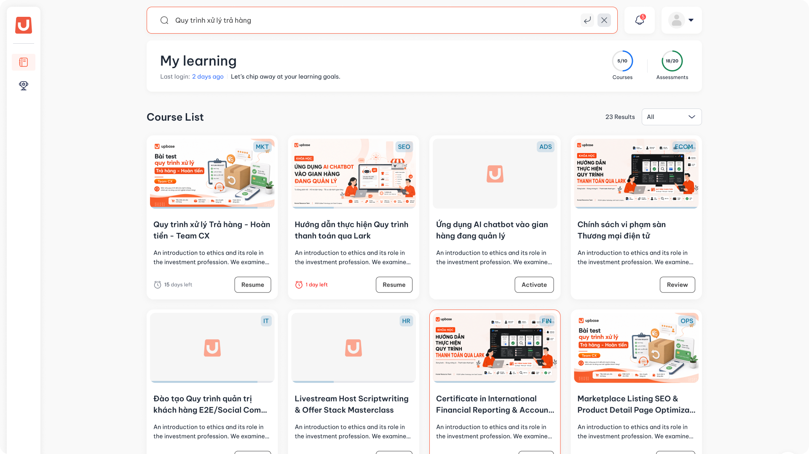

---
layout:
  width: default
  title:
    visible: true
  description:
    visible: false
  tableOfContents:
    visible: true
  outline:
    visible: true
  pagination:
    visible: true
  metadata:
    visible: false
  tags:
    visible: true
  actions:
    visible: true
---

# Danh sách khóa học

## I. Thông tin chung


**Dành cho:** Học viên

**URL:** [LMS → My Course](https://uplms.upbase.asia/courses)



#### Phạm vi & Module liên quan

* **Module chính:** My Learning
* **Module liên quan:** Course Category, Tìm kiếm khoá học



#### Điều kiện tiên quyết

* Học viên đã **đăng ký khóa học**
* Học viên đã **đăng nhập** hệ thống UpLMS thành công thông qua **Lark** [#dang-nhap-vao-he-thong](../tai-khoan/dang-nhap-dang-xuat.md#dang-nhap-vao-he-thong "mention")


## II. Hướng dẫn chi tiết

Xem danh sách Khóa học



**Truy cập màn hình My Learning**

Sau khi đăng nhập hệ thống thành công, học viên chọn màn hình **My Learning** để xem tất cả những khóa học mà học viên đã đăng ký.

<figure><figcaption></figcaption></figure>

Tại màn hình này, học viên sẽ thấy thông tin cụ thể của từng Khóa học:

* **Tên Khóa học**
* **Giới thiệu tổng quan về Khóa học**
* **Tiến độ học của học viên**
* **Thời hạn còn lại của Khóa học**
* **Trạng thái của Khoá học** (Đã activated hay chưa)



Tìm kiếm Khóa học theo tên



**Nhập tên Khóa học vào thanh tìm kiếm**

<figure><figcaption></figcaption></figure>



**Nhấn Enter để tìm kiếm khóa học**

Sau khi nhập, đợi **3-5 giây** hoặc nhấn **Enter**, hệ thống sẽ trả ra các kết quả phù hợp với điều kiện tìm kiếm cùng với tổng số kết quả.

<figure><figcaption>
<em>Kết quả tìm kiếm Khóa học theo tên</em>
</figcaption></figure>



Lọc Khóa học theo điều kiện cho trước



**Mở bộ lọc**

Tại màn hình **My Learning**, học viên nhấp vào nút **Filter** theo **Danh mục Khóa học** hoặc theo **Trạng thái Khóa học**.

<figure><figcaption>
<em>Bộ lọc theo Danh mục Khóa học</em>
</figcaption></figure>

<figure><figcaption>
<em>Bộ lọc theo Trạng thái của Khóa học</em>
</figcaption></figure>



**Chọn điều kiện lọc**

Chọn **Danh mục** hoặc **Trạng thái** muốn xem để lọc các Khóa học thỏa mãn. Học viên có thể **lọc kết hợp** các điều kiện cùng lúc.

<figure><figcaption>
<em>Kết quả sau khi lọc theo điều kiện</em>
</figcaption></figure>


💡 **Mẹo:** Học viên có thể sử dụng **kết hợp** chức năng _Tìm kiếm Khóa học theo tên_ và _Lọc Khóa học theo điều kiện cho trước_ để thu hẹp kết quả nhanh hơn.




## III. Lưu ý & Quy tắc nghiệp vụ


### Lưu ý quan trọng

1. Màn hình **My Learning** chỉ hiển thị các khóa học mà học viên **đã được thêm** trên hệ thống. Nếu không thấy khóa học mong muốn, học viên cần kiểm tra lại với đội L\&D
2. Thông tin **Thời hạn còn lại của Khóa học** sẽ hiển thị khác nhau theo loại khóa học:
   * **Khóa học có thời hạn cố định:** thời hạn được tính theo khoảng thời gian trùng với lịch trình chung của lớp học (Ví dụ: 1/1/2026 - 31/12/2026, hiện tại là 1/12/2026 thì thời hạn còn lại là 30 ngày).
   * **Khóa học có thời hạn linh động:** thời hạn được tính từ thời điểm học viên **kích hoạt (Activate)** khóa học (Ví dụ: khóa học có 60 ngày để học, sau khi học viên kích hoạt, hệ thống sẽ đếm ngược từ 60 về 0).
3. Bộ lọc hỗ trợ **lọc kết hợp** nhiều điều kiện cùng lúc (vừa theo Danh mục vừa Trạng thái) và có thể kết hợp với Tìm kiếm theo tên.
4. **Tiến độ học** hiển thị trên Khóa học được tính dựa trên số Activity đã hoàn thành trên tổng số Activity của khóa học.



### Mẹo sử dụng

1. Sử dụng **bộ lọc theo Trạng thái** để xác định các khóa đang học, sắp hết hạn hoặc cần kích hoạt.
2. Theo dõi **Thời hạn còn lại** trên Khóa học để chủ động hoàn thành khóa học trước khi hết hạn.
3. Đối chiếu **Tiến độ học** giữa các khóa học để phân bổ thời gian học.


## IV. Các lỗi thường gặp & Hướng dẫn xử lý

| Lỗi / Tình huống                                                 | Nguyên nhân                                                                                                              | Cách xử lý                                                                                                                              |
| ---------------------------------------------------------------- | ------------------------------------------------------------------------------------------------------------------------ | --------------------------------------------------------------------------------------------------------------------------------------- |
| Không thấy bất kỳ khóa học nào trong My Learning                 | <ul><li>Tài khoản chưa được gán vào lớp học</li><li>Tài khoản đã được gán vào lớp nhưng lớp học chưa Published</li></ul> | Liên hệ đội vận hành để xác nhận đã được thêm vào lớp học chứa khóa học tương ứng                                                       |
| Tìm kiếm theo tên không trả về kết quả mong đợi                  | Nhập sai chính tả hoặc tên khóa học khác với tên hiển thị trên hệ thống                                                  | Kiểm tra lại chính tả; thử nhập từ khóa ngắn hơn (chỉ một phần tên); kết hợp dùng bộ lọc theo Danh mục.                                 |
| Đã dùng bộ lọc nhưng vẫn không thấy khóa học cần tìm             | Lọc kết hợp nhiều điều kiện không có khóa học nào thỏa mãn                                                               | Bỏ bớt điều kiện lọc, hoặc reset bộ lọc rồi thử lại với các điều kiện khác.                                                             |
| Thông tin **Thời hạn còn lại** hiển thị "0 ngày" hoặc đã hết hạn | Khóa học đã hết thời hạn truy cập                                                                                        | Liên hệ đội vận hành để được hỗ trợ và gia hạn.                                                                                         |
| Tiến độ học không cập nhật dù đã hoàn thành Activity             | Activity chưa được đánh dấu Hoàn thành                                                                                   | <ul><li>Xác nhận lại Activity đã Hoàn thành đảm bảo có icon Completed hiển thị</li><li>Tải lại trang My Learning để cập nhật.</li></ul> |
